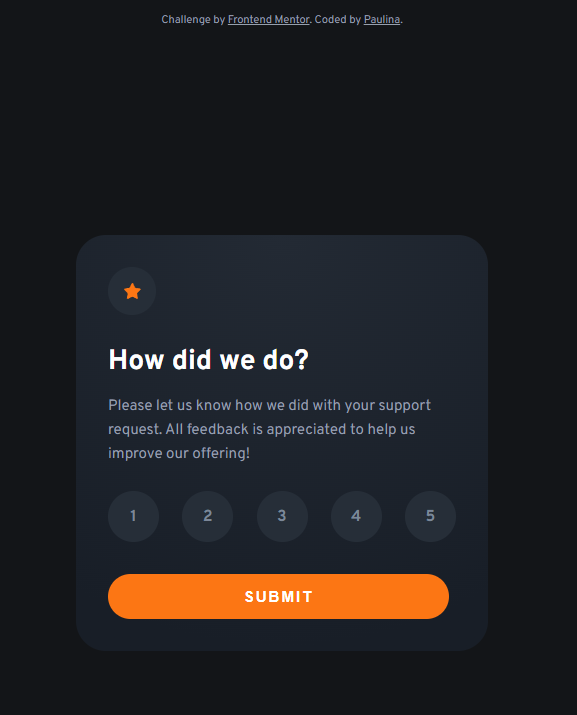

# Frontend Mentor - Interactive rating component solution

This is my own solution to the [Interactive rating component challenge on Frontend Mentor](https://www.frontendmentor.io/challenges/interactive-rating-component-koxpeBUmI). Frontend Mentor challenges help improve coding skills by building realistic projects. 

## Table of contents

- [Overview](#overview)
  - [The challenge](#the-challenge)
  - [Screenshot](#screenshot)
  - [Links](#links)
- [My process](#my-process)
  - [Built with](#built-with)
- [Author](#author)

## Overview

### The challenge

Users should be able to:

- View the optimal layout for the app depending on their device's screen size
- See hover states for all interactive elements on the page
- Select and submit a number rating
- See the "Thank you" card state after submitting a rating

### Screenshot

### Links

- Live Site URL: [Interactive Rating Component](https://testerium-interactive-rating-component.app/)

## My process

It took me 1 hour to implement both views using HTML, CSS, SCSS. The design is responsive. I developed the mobile version without any problems. I am constantly learning JavaScript, its application still takes me a long time. I continue to develop in this area.

### Built with

- HTML
- CSS 
- SCSS
- Flexbox
- JavaScript

## Author

- Frontend Mentor - [@testerium](https://www.frontendmentor.io/profile/testerium)

